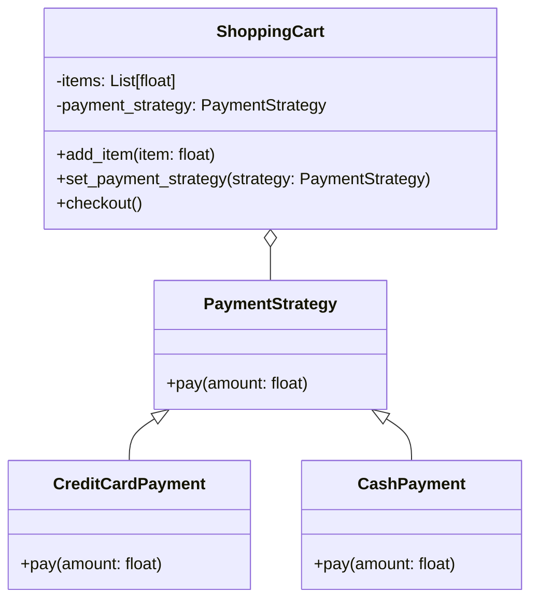

# Львівський Національний Університет Природокористування
## Кафедра Інформаційних систем та Технологій

### Звіт про виконання лабораторної роботи №3
### Тема: "Поведінкові патерни проектування"

| Виконав: студент групи КН-31 Плитич Василь |  
| ------------------------------------------ |  
| Перевірив: Татомир Андрій                  |  

---

### Мета
Познайомитися з групою поведінкових патернів та дослідити їхнє застосування на практиці.

---

### Хід роботи

1. Теоретичний опис поведінкових патернів.
2. Теоретичний опис вибраного патерну.
3. Приклад коду, що реалізовує вибраний патерн.
4. UML-діаграма для пояснення архітектури.

---

### Опис поведінкових патернів

Поведінкові шаблони проектування зосереджені на взаємодії між об'єктами, визначаючи способи комунікації між ними, а також управління поведінкою об'єктів.
 Вони допомагають зменшити зв'язність між об'єктами, що полегшує підтримку та розширення програмного коду. Основною метою поведінкових шаблонів 
 є поліпшення управління алгоритмами, контролю за взаємодією об'єктів та організації поведінки.

Серед найвідоміших поведінкових шаблонів можна виділити:

Стратегія (Strategy): дозволяє визначити сімейство алгоритмів, упакувати їх у окремі класи та забезпечити їх взаємозамінність.
Спостерігач (Observer): визначає залежність "один-багато" між об'єктами так, що при зміні стану одного об'єкта всі його залежні об'єкти сповіщаються та оновлюються автоматично.
Команда (Command): інкапсулює запит як об'єкт, що дозволяє параметризувати клієнтів з різними запитами, ставити запити в чергу та підтримувати скасування операцій.
Ітератор (Iterator): надає спосіб доступу до елементів колекції без розкриття її внутрішньої структури.
Стан (State): дозволяє об'єкту змінювати свою поведінку в залежності від внутрішнього стану.

Поведінкові шаблони сприяють гнучкості коду та зменшенню його складності, а також допомагають розділяти відповідальність між класами.

### Ітератор: 
Патерн "Стратегія" визначає сімейство алгоритмів, упакованих у окремі класи, які можна використовувати взаємозамінно.
 Цей шаблон дозволяє змінювати алгоритми незалежно від клієнтів, які їх використовують. 
 Він є особливо корисним, коли алгоритм, який потрібно змінити, залежить від конкретного контексту або обставин.

#### Пояснення UML-діаграми

На діаграмі показано зв'язок між класами **Collection** та **Iterator**. Клас **Iterator** інкапсулює механізм послідовного доступу до елементів колекції. Клас **Collection** надає методи для додавання елементів та створення ітератора, що дозволяє обійти елементи колекції.

---

### Висновок

Патерн "Стратегія" є потужним інструментом у об'єктно-орієнтованому програмуванні, що дозволяє реалізовувати взаємозамінність алгоритмів.
Використовуючи цей патерн, можна легко адаптувати програми до нових вимог, зберігаючи при цьому чистоту і гнучкість коду.

---

